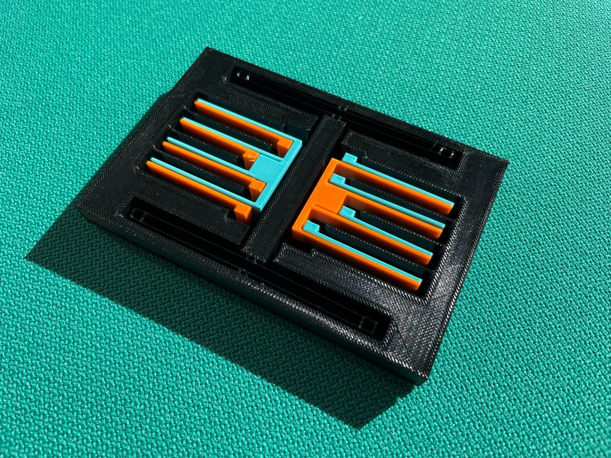
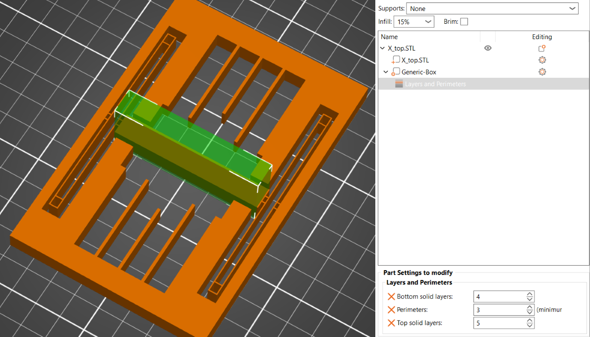
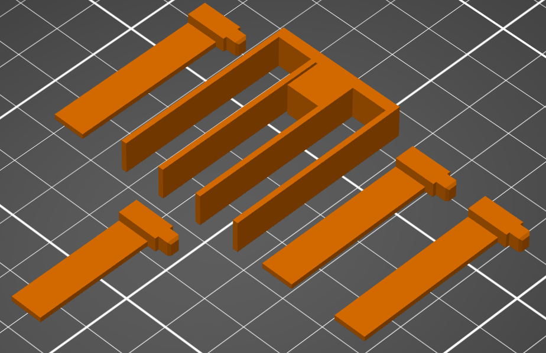

# Single Axis Accelerometer Model
- Description
- Requirements for Replication
- Part List and Printing Settings
  - General Printing Settings
    - Base Color
    - Color 1
    - Color 2
  - Part: X-Axis MEMS Element (X\_axis)
    - Printing Settings
- Further Material

	
# Description

This is a scaled-up generic MEMS single-axis accelerometer 3D model for educational purposes. 
The size of this model is about 250 times larger than that of a MEMS accelerometer.

# Requirements for Replication
- 3 colors of PETG filament
- 3D printer with a 0.4mm nozzle
- Clean print bed with good adhesion is necessary to prevent parts from coming off the print bed while printing
- For the proof mass to move as intended, the print settings below must be followed closely to get the right weight and stiffness

# Part List and Printing Settings

These instructions are based on PrusaSlicer, but other slicers should work as well. Note that settings may differ between slicers. Some parts may be challenging to print, so replication could require extra effort. A STEP file is included for easy model adjustments to fit different printing setups. In order to print the parts correctly, pay attention to the orientation of the parts. Most of the parts have to be rotated before slicing. Use the screenshots below as reference.  

## General Printing Settings
- Layer height: 0.2mm
- 5 Top Layers
- 5 Bottom Layers
- 10% Cubic-Infill

The parts in the following can all be printed using the settings mentioned above

### Base Color
* 1x Base

### Color 1
* 1x X_axis_electrode_short
* 3x X_axis_electrode_long
* 1x X_axis_electrodes

 

### Color 2
* 1x X_axis_electrode_short
* 3x X_axis_electrode_long
* 1x X_axis_electrodes

## Part: X-Axis MEMS Element (X_axis)

### Printing Settings:
- Perimeter Generator: Arachne
- 1 Perimeter
- 3 Top Layers
- 1 Bottom Layer
- 15% Lightning Infill

To increase strength around the attachments, add a box as a modifier by right clicking the part and set the perimeters to 3 and the bottom layers to 3. Make sure that the box does not encompass the meeting point between the springs and the middle rectangle.

# Further Material
[Evolution of Bosch Inertial Measurement Units for Consumer Electronics [YouTube]](https://youtu.be/YX_pCtbetUU?si=Y48k9YNXbdLkJ2fi)

[Bosch MEMS sensors: Working principle of an accelerometer [YouTube]](https://youtu.be/RLQGZl0lpjQ?si=H11uKwXcvrlZT_3T)